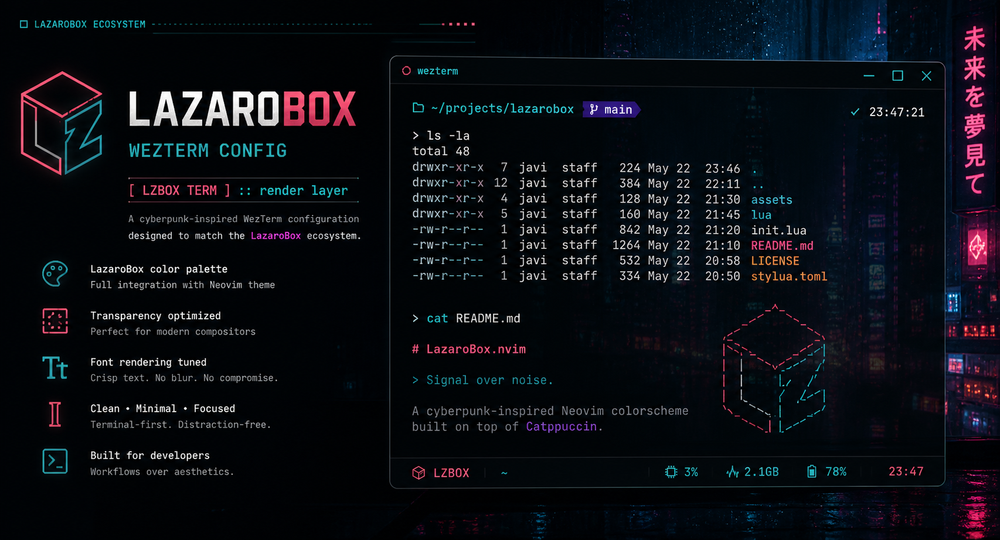

# 🟥 LazaroBox WezTerm

```text
[ LZBOX TERM ] :: render layer
```

> A cyberpunk-inspired WezTerm configuration designed to match the LazaroBox ecosystem.

Optimized for color fidelity, transparency, and terminal-native workflows.

---

## Philosophy

The terminal is not just a shell — it's the canvas.

This configuration focuses on:

Accurate color reproduction (Neovim parity)
Controlled contrast for readability
Minimal UI noise
Smooth rendering in transparent environments

## Features

- LazaroBox color palette integration
- Transparent background tuning
- Optimized font rendering
- Cursor + selection visibility improvements
- Clean UI (no unnecessary decorations)

## Installation

Clone the repository:

```bash
git clone https://github.com/pichu2707/wezterm-javi-config ~/.config/wezterm
```

Or manually copy:

```bash
~/.config/wezterm/wezterm.lua
```

## Configuration

This setup includes:

Custom color scheme aligned with LazaroBox.nvim
Transparency settings for compositors
Font + rendering tweaks

Example snippet:

```lua
return {
  color_scheme = "LazaroBox",
  window_background_opacity = 0.9,
  enable_tab_bar = false,
}
```

## Ecosystem

Part of the LazaroBox system:

- 🖥️ Neovim → https://github.com/pichu2707/lazarobox-nvim
- 🟧 WezTerm → this repository
- 🔗 Recommended Setup

For best results:

- Neovim → LazaroBox.nvim
- Terminal → WezTerm config
- Compositor → transparency enabled

This ensures consistent color rendering across the entire stack.

## Design Notes

Colors are tuned to match Neovim highlights exactly
Background opacity is balanced to avoid washout
UI elements are minimized to keep focus on content

## Author

Javi Lázaro
https://www.javilazaro.es

📜 License

MIT
